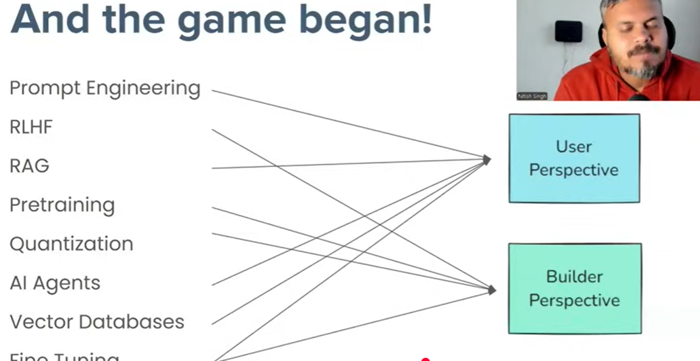
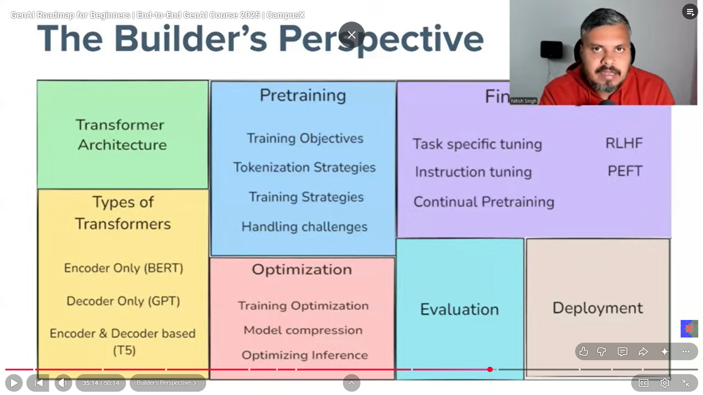
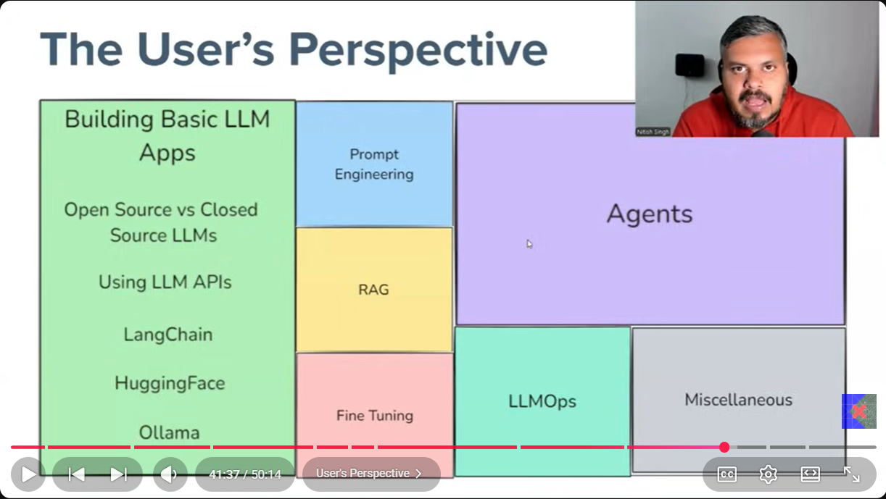

##A framework is engineered by solving common software problems once, organizing them into reusable components, and controlling the application's flow so developers only write the business logic.
# Library vs Framework

## Library
- Collection of reusable code.
- You call the library.
- You control the program flow.
- Example: NumPy, Pandas, Requests.

## Framework
- Structure for building applications.
- The framework calls your code.
- The framework controls the program flow.
- Example: FastAPI, Django, LangChain.

## Memory Trick
**Library = You call it.**
**Framework = It calls you.**

customer support 
content creation
eduction

internet is the best technology successful

in the ml all the models we made are the task specific
FOundation models ( need a large amount of data like internent best example is llm)

it can be builder 
it can be used as a user

All the files are del
