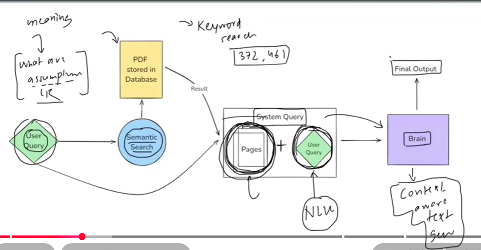
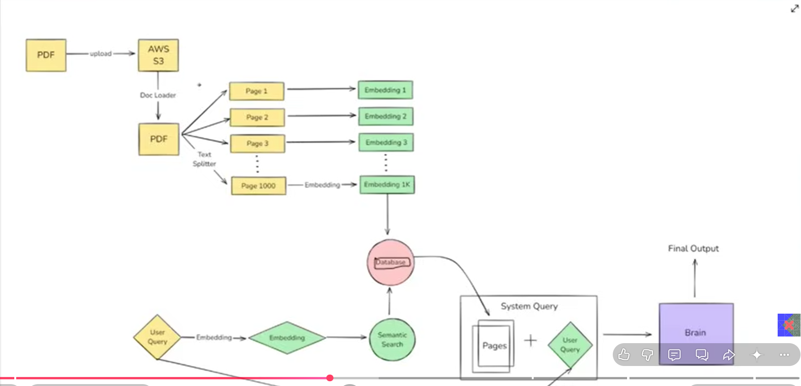

# Langchin
example in 2014 
a pdf chatbot 

all process

the challenges in the picture is to mak the  barin 
which can do 

1 understand the quries and the 
2 and give acording to the relevent text 

but in 2017 llm came, transformer came and solve this problem
now we have to use this

Concept of chains

Model Agnostic Development like do not focus on the component focus on the logic, you have to hange only 1 line of cpde

Complete ecosystem

Memory and state handling
it is very usfull
