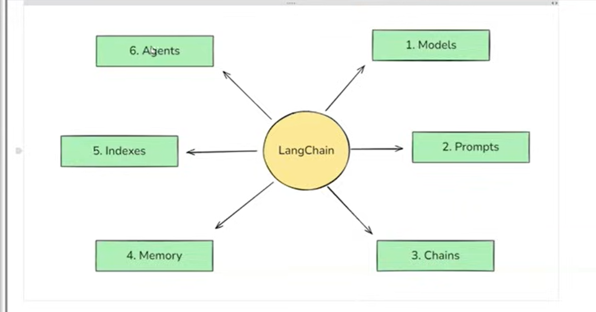
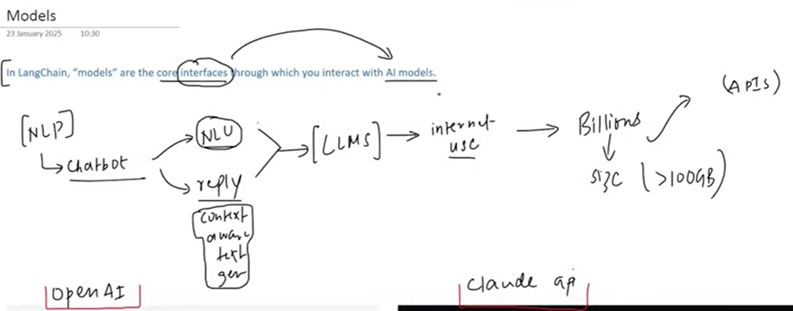
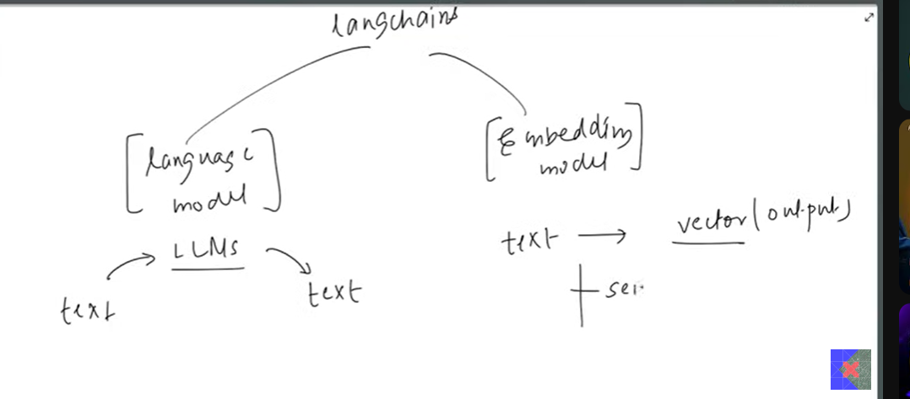

   components
in nlp the main goal o fveery one is to make the chatbot
ND THE MAIN PROBLRM IS 

======Natural language understanding 
   reply
   context awairness

LLM came and start using this problrm as it has huge paramenters and alot of size 
ther was a problem whener two type of models like openai adn claude model 
for both ,odel we have to write the seprete code this was a big problem

so langchain came and make an interface 
